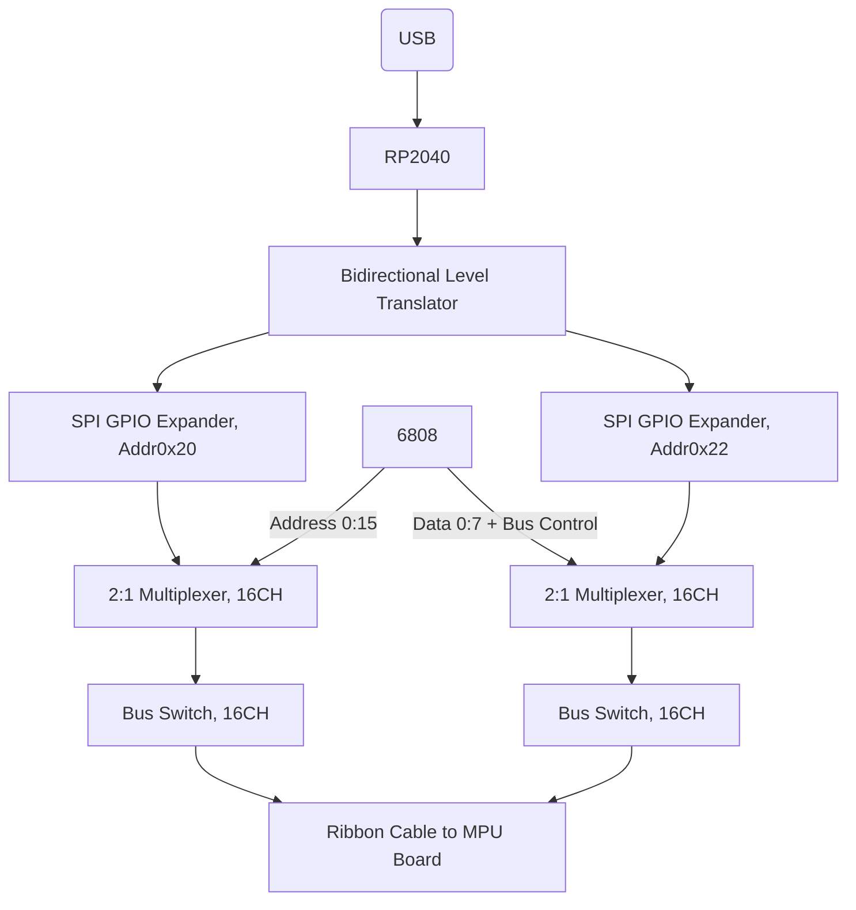
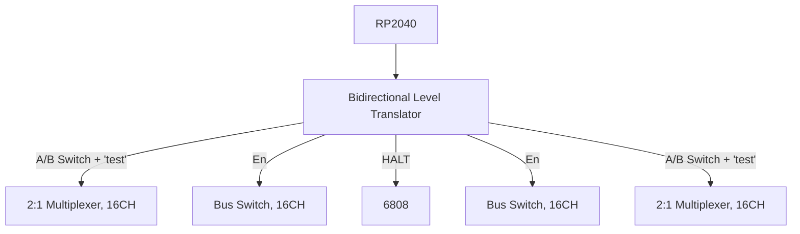

# Legacy Pinball Classics Controller

## Specifications:

- Enables communication between Mission Pinball Frameworks (MPF) and 6808/6802 based Williams MPU Boards. Designed for System 6, with System 3-7 support coming soon.
- Compatible with existing original or aftermarket MPU and Driver boards
- Drop in replacement for MC6808 CPU IC1
- USB Interface makes MPF computer connection easy, with a high retention USB-B connector

### Planned:

- Onboard 6808 socket enables true original code execution, switchable via Mission Pinball control
- Enhanced hardware debugging via Classics Controller helps identify bad ROMs, RAM, PIAs, and more

### Future:

- MPU/Driver Emulation mode enables virtual memory space for 6808 which can be modified in real time, via the Bus Interconnect Matrix
- 6808 Emulation mode eliminates the need for a real 6808 CPU

## Hardware overview: 

- Classics Controller is comprised of a custom PCB hosting an onboard RP2040 with 2+MB flash, socketed 6808 with crystal, and bus interfacing ICs.
- Optional USB isolation IC ADUM3160 and 5V-5V isolated module adds $20-$25 to BOM.
- RP2040 communicates with the MPU bus using 2 Microchip MCP23S17 SPI GPIO expanders, adding an additional 32 pins for bus data, addressing, and bus logic (such as VMA, IRQ, NMI, Reset monitoring, and Φ2). 
- RP2040 interfaces with MCP23S17 via an 8 channel 3.3V to 5V bidirectional logic level translating buffer.
- The RP2040 expander bus is 2:1 multiplexed with the real 6808 bus using 2 Texas Instruments [SN74CBT16233DGGR](https://www.ti.com/product/SN74CBT16233/part-details/SN74CBT16233DGGR), 16 channel bidirectional general purpose bus multiplexer (mux), providing a total of 32 channels of bus control.
- The output of the 2:1 bus multiplexer is connected to 2 Texas Instruments [SN74CBT16245C](https://www.ti.com/product/SN74CBT16245C), a 16 channel bidirectional 1:1 bus switch, enabling the disconnect of the Classics Controller from the MPU bus. In conjunction with the "Test" inputs of the 2:1 bus mux, this allows the RP2040 to communicate directly with the 6808 without any interference from devices on MPU or Driver board. In the future, this can allow the RP2040 to emulate the MPU board and control the state of a live 6808 CPU.
- Classics Controller connects to System 6 MPU via ribbon cable and 40 position 0.600" DIP IDC connector. The Classics Controller hosts a keyed, standard 2x20 2.54mm male header connector. 

### Simplified Hardware Diagrams

#### Overview:

#### Address and Data Flow:

#### Buffer Control:

## Firmware Overview

The Firmware for the Legacy Pinball Classics Controller is written in MicroPython.

Both cores of the RP2040 are utilized:

### Core 0:

- Initializes USB Serial and SPI Component
- Waits for a connection with MPF
- Disables 6808
- Implements serial protocol to communicate with MPU board
- Manages locks and mailboxes
- Schedules core 1

### Core 1:

- Abstracts address translation layer
- Polls and writes to PIA on MPU and Driver Board
- Handles bus control